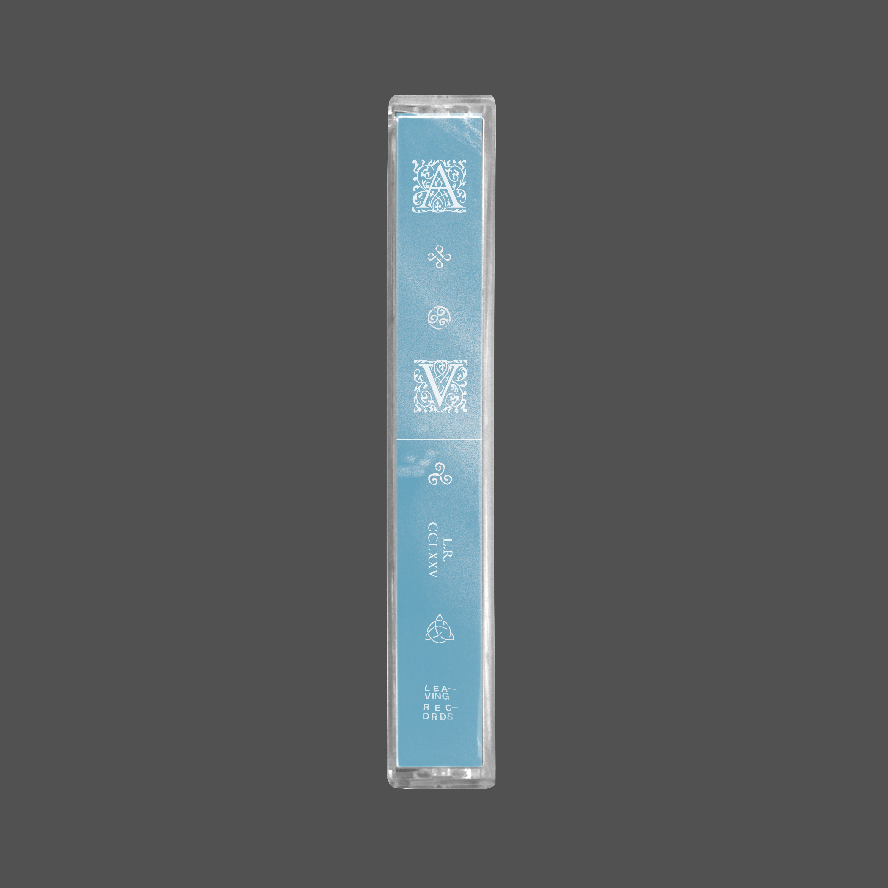

Hi _!_

We’re ampersands — a small studio focused on [visual design](), [code](), and [illustration](). 

We like working on [brands](), [websites](), [generative animation](), [music campaigns](), editorial illustrations, or anything we’ve never done before. Our main contributor is [andrew c. shike](https://andrewcs.life), based in chicago, and we love to collaborate.

Get in touch at [andrewcshike@gmail.com](mailto:andrewcshike@gmail.com)

This site is still being born, but in the meantime, you can check out some images of some work that we’re proud of below

**-&&**















**PROJECT:** Web & animation for [leavingrecords](leavingrecords.com)

**CONTRIBUTORS:** [andrew c. shike](andrewcs.life)


















**PROJECT:** Art direction for Aisha Vaughan _"The Gate"_

**CONTRIBUTORS:** [andrew c. shike](andrewcs.life) (photography by Max Blomfield)

