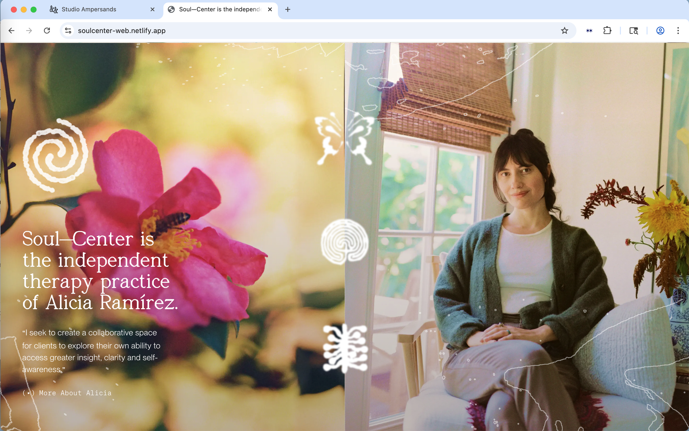
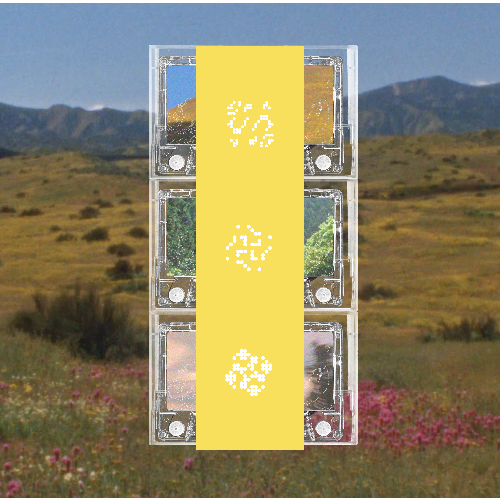
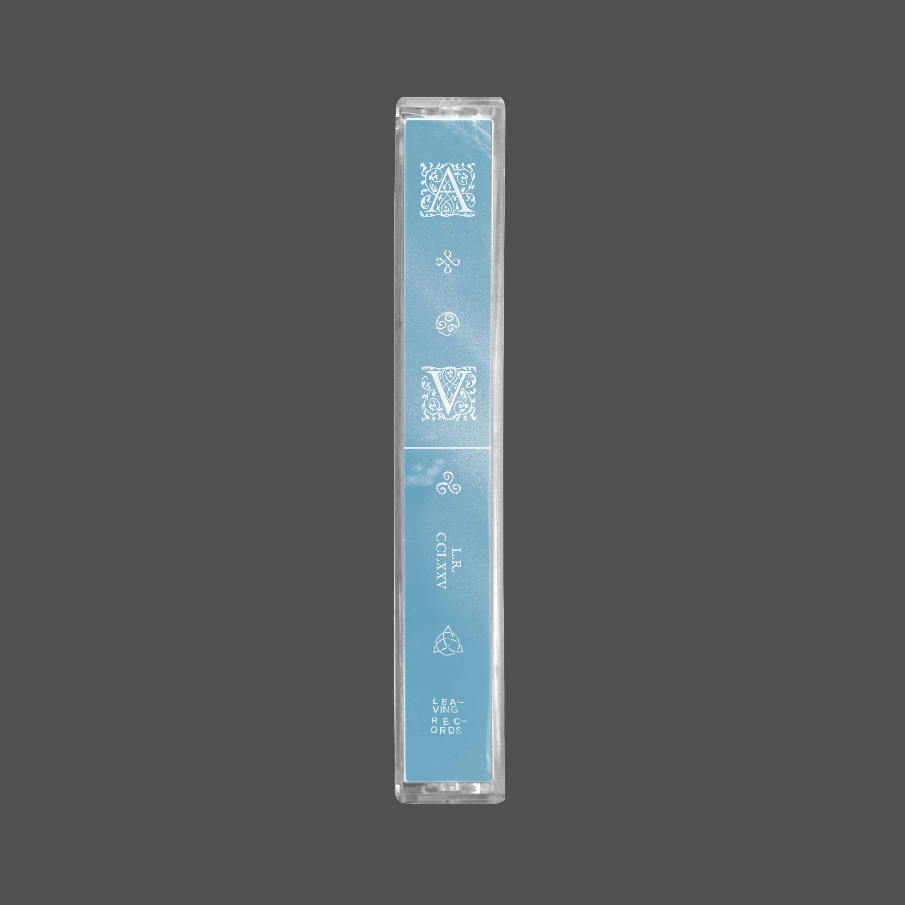
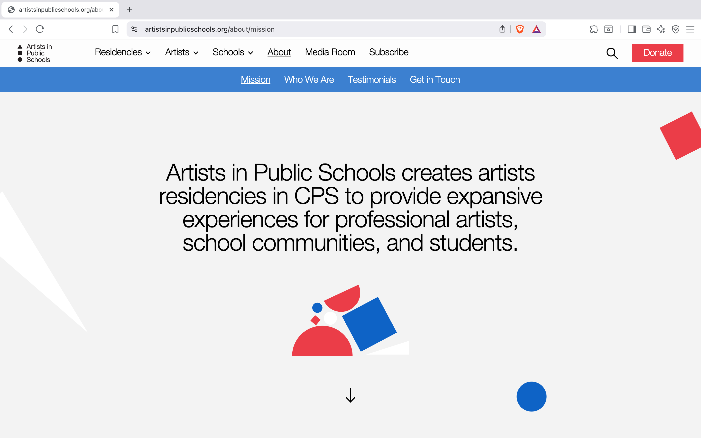
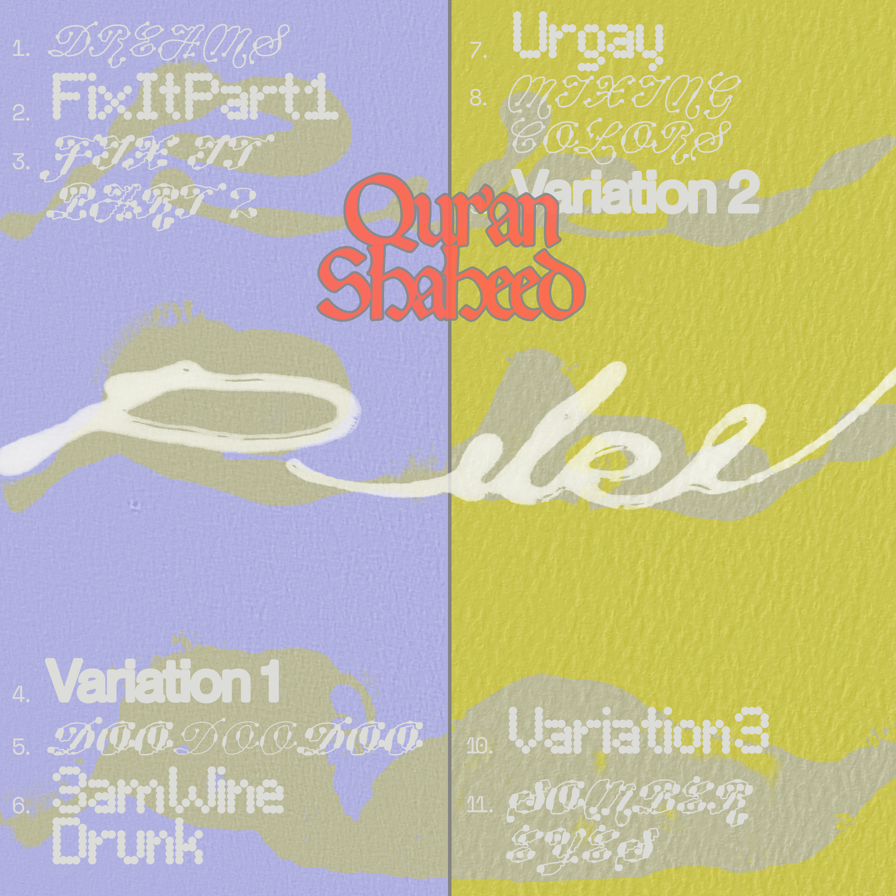
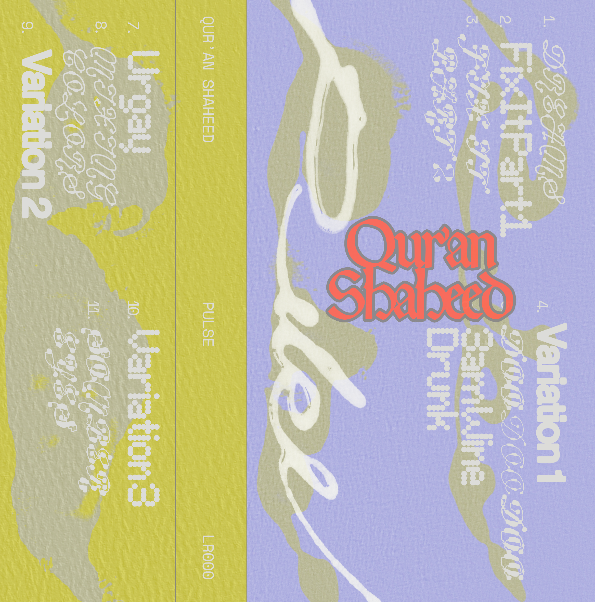
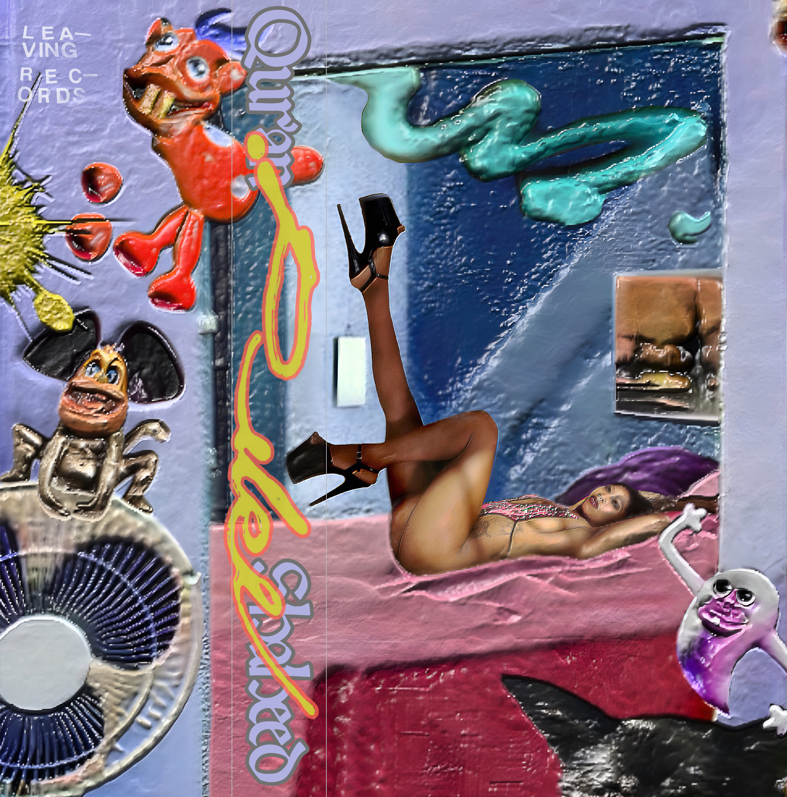
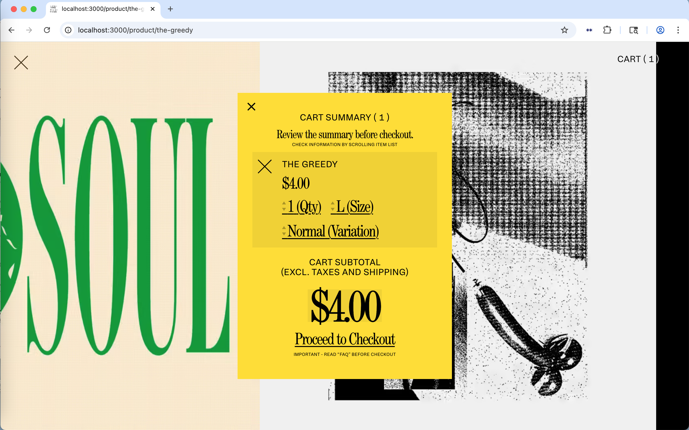
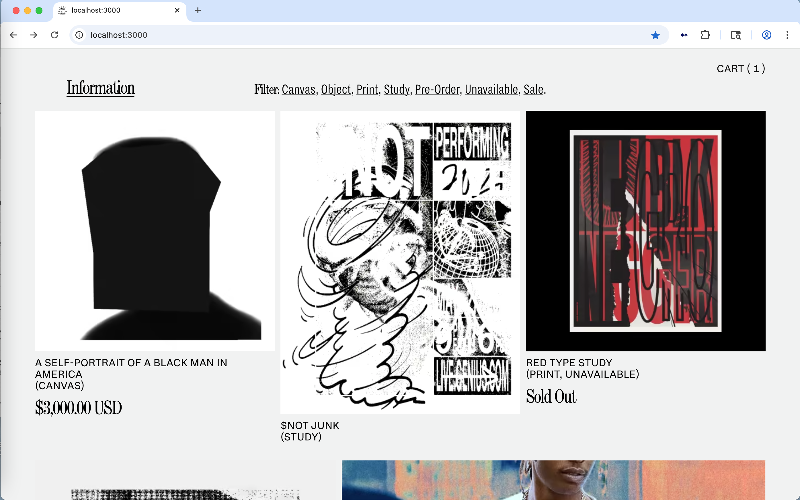

Studio Ampersands is the independent design practice of [and c. shike](https://and-cs.co) – focused on [visual design](#pulse), [UX](#aips), [code](#leaving-records), and [illustration](#julius-smack-serenity).

I like working on [brands](#ambient-church), [websites](#leaving-records), [generative animation](#staying), [music campaigns](#aisha-vaughan), editorial illustrations, or anything I've never done before. Currently based in Chicago.

Get in touch at [hi@ampersands.space](mailto:hi@ampersands.space)

This site is still being born, but in the meantime, you can check out some images of work that I'm proud of below

**-&&**












**PROJECT:** Branding, Web design, Web development for Soul–Center ([link](https://soulcenter-web.netlify.app/) - w.i.p.)

**CONTRIBUTORS:** [and c. shike](https://and-cs.co)




















**PROJECT:** AD & [music video](https://www.youtube.com/watch?v=djQhHlXM6SA) for leaving records "staying" compilation

**CONTRIBUTORS:** [and c. shike](https://and-cs.co) (graphics) [erran franklin](instagram.com/errenfranklinfilms) (8mm film)




















**PROJECT:** Web & animation for leavingrecords ([website](https://leavingrecords.com))

**CONTRIBUTORS:** [and c. shike](https://and-cs.co)




















**PROJECT:** Art direction for Aisha Vaughan _"The Gate"_

**CONTRIBUTORS:** [and c. shike](https://and-cs.co) (photography by Max Blomfield)














**PROJECT:** Web design, UX, dev for Artists in Public Schools ([link](https://cpslives.org))

**CONTRIBUTORS:** [Nick Rissmeyer](https://nickrissmeyer.com/), [Emily Gorski](http://emilygorski.com/), [and c. shike](https://and-cs.co)














**PROJECT:** Illustration, AD, and poster for Julius Smack _"Serenity"_

**CONTRIBUTORS:** [and c. shike](https://and-cs.co)




















**PROJECT:** Art direction for The Growth Eternal _"Live at Susan's"_

**CONTRIBUTORS:** [and c. shike](https://and-cs.co). photography: friends








**PROJECT:** Web design, UX, dev for online exhibition "(Re)visions of Chicago Public Schools" ([link](https://andr-ew.github.io/rcps/))

**CONTRIBUTORS:** [and c. shike](https://and-cs.co)














**PROJECT:** Art direction for Matthewdavid _"Uncleared"_

**CONTRIBUTORS:** [and c. shike](https://and-cs.co). illustration: BlissArmyKnife

















**PROJECT:** Art direction for Qur'an Shaheed _"Pulse"_

**CONTRIBUTORS:** [and c. shike](https://and-cs.co), artwork by Frank Dorrey








**PROJECT:** Web design, dev for Adam Levite ([link](https://adamlevite.netlify.app) - w.i.p.)

**CONTRIBUTORS:** [and c. shike](https://and-cs.co)














**PROJECT:** Wordmark + posters commissioned by [ambient church](https://ambient.church)

**CONTRIBUTORS:** [and c. shike](https://and-cs.co)











**PROJECT:** E-commerce Web development for August Foreman ([link](https://shop-aug-services-dev-git-dev-andr-ew.vercel.app/) - w.i.p.)

**CONTRIBUTORS:** development: [and c. shike](https://and-cs.co), design: August Foreman






































**PROJECT:** Artwork, AD, & posters for Andrew CS _"caught in pointers"_

**CONTRIBUTORS:** [and c. shike](https://and-cs.co)








**PROJECT:** Web-based motion concept commissioned by Ry X ([link - night](https://andr-ew.github.io/ry-x-fluid-handoff/night), [link - day](https://andr-ew.github.io/ry-x-fluid-handoff/day) – [cancelled])

**CONTRIBUTORS:** [and c. shike](https://and-cs.co)























**PROJECT:** Identity concepts commissioned by Ry X [cancelled]

**CONTRIBUTORS:** [and c. shike](https://and-cs.co)


